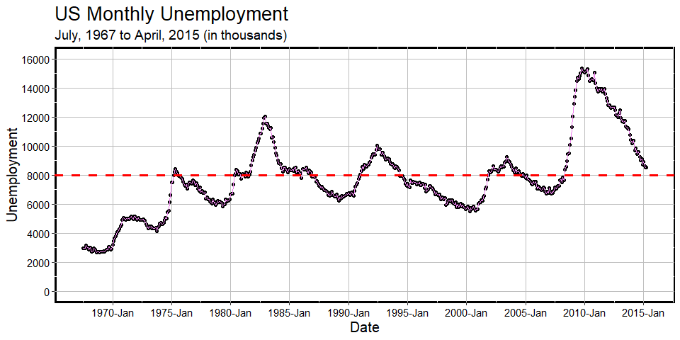

# RplotterPkg

The goal of RplotterPkg is to provide easy access to the many ggplot2
geom plotting routines for everyday use. The package uses a functional
approach along with the fast, efficient data frame processing from
[`data.table`](https://github.com/Rdatatable/data.table "data.table github").

## Installation

You can install the development version of RplotterPkg from
[GitHub](https://github.com/) with:

Using `pak::pak()`:

`pak::pak("deandevl/RplotterPkg")`

Using `devtools::install_github()`:

`devtools::install_github("deandevl/RplotterPkg")`

## Examples

The following script shows how simple it is to create a standard scatter
plot. Other standard plots include bar, box, density, density_ridge,
histogram, range, heatmap, and stick plots.

Other functions for plots are available including multi_panel,
spread_level, stem_leaf, and symmetry.

Additional examples showing heatmap, waffle, and stem_leaf are available
[here](https://rplotterpkg-ex.netlify.app/).

``` r
library(ggplot2)
library(RplotterPkg)

RplotterPkg::create_scatter_plot(
    df = ggplot2::economics,
    aes_x = "date",
    aes_y = "unemploy",
    pts_shape = 21,
    pts_fill = "black",
    line_color = "violet",
    connect = TRUE,
    title = "US Monthly Unemployment",
    subtitle = "July, 1967 to April, 2015 (in thousands)",
    x_title = "Date",
    y_title = "Unemployment",
    rot_y_tic_label = TRUE,
    x_date_labels = "%Y-%b",
    x_major_date_breaks = "5 year",
    y_limits = c(0, 16000),
    y_major_breaks = seq(0, 16000, 2000),
    show_minor_grids = F,
    bold_y = 8000,
    bold_y_color = "red",
    bold_y_linetype = "dashed"
  )
```


